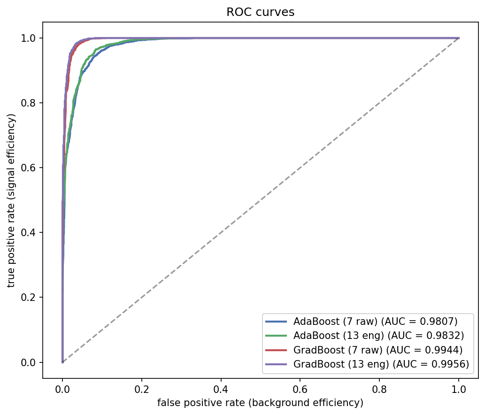
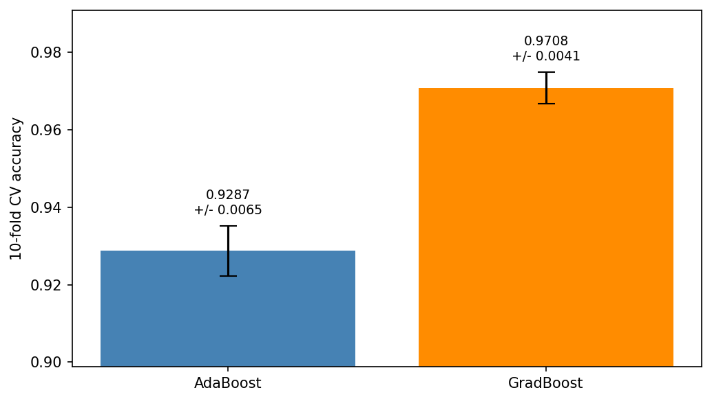
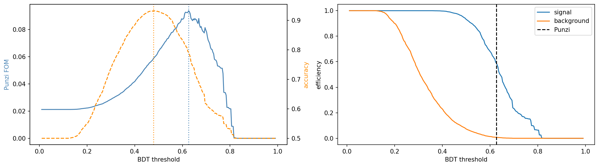
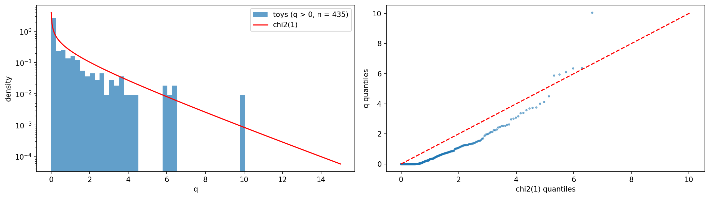

# Particle Discovery — B_s → μμ

search for the rare decay B_s → μμ in 10k signal + 10k background events. build a classifier, optimise the selection, figure out how long the experiment needs to run for a 5σ discovery.

## results

BDT selection applied to all features (excluding MASS to keep the fit unbiased):



best model (gradient boosting + engineered features) gets 97.3% accuracy, 99.3% signal efficiency, 3.5% background efficiency.



Punzi FOM finds the threshold that actually minimises experiment runtime instead of just maximising accuracy:



Wilks' theorem validity — check that q ~ chi2(1) holds at our sample size:



## how to run

run the notebooks in order:

1. `features.ipynb` — rank features by Fisher score
2. `selection.ipynb` — rectangular cuts on top 3 features
3. `bdt.ipynb` — train BDTs, apply selection
4. `mass_fit.ipynb` — background fit, toy MC, discovery duration

extensions (run after the main pipeline):

5. `extensions/punzi_fom.ipynb` — Punzi FOM threshold scan
6. `extensions/wilks_validation.ipynb` — Wilks' theorem check with H0 toys
7. `extensions/classifier_improvements.ipynb` — feature engineering, gradient boosting, k-fold CV

## files

```
data/                           signal + background samples
plots/                          all output figures
features.ipynb                  feature ranking
selection.ipynb                 rectangular cut optimisation
bdt.ipynb                       BDT training + evaluation
mass_fit.ipynb                  significance + discovery duration
extensions/                     punzi fom, wilks check, classifier improvements
fisher_scores.csv               feature ranking (from features.ipynb)
cut_params.json                 optimal cuts (from selection.ipynb)
bdt_results.json                efficiencies (from bdt.ipynb)
bdt_model.pkl                   trained AdaBoost model
fit_params.json                 background slope (from mass_fit.ipynb)
improved_model.pkl              trained gradient boosting model
improved_results.json           CV scores + efficiencies
```
