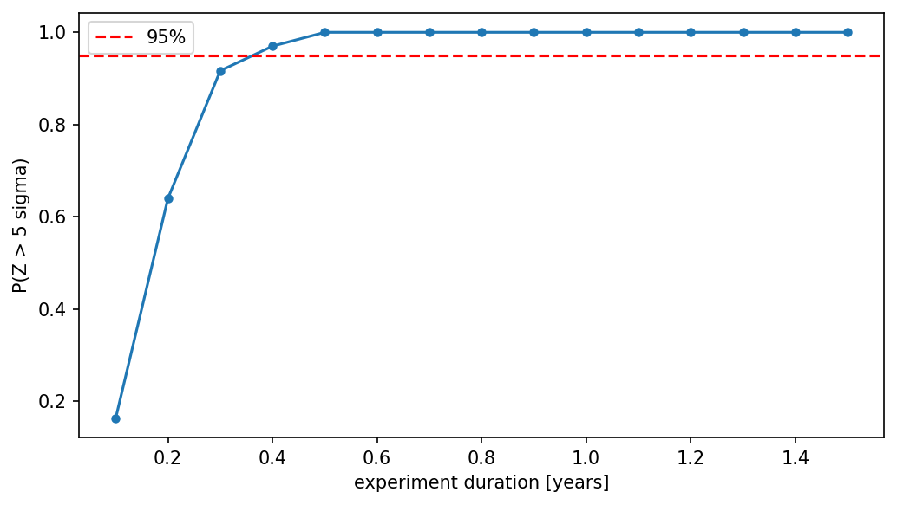
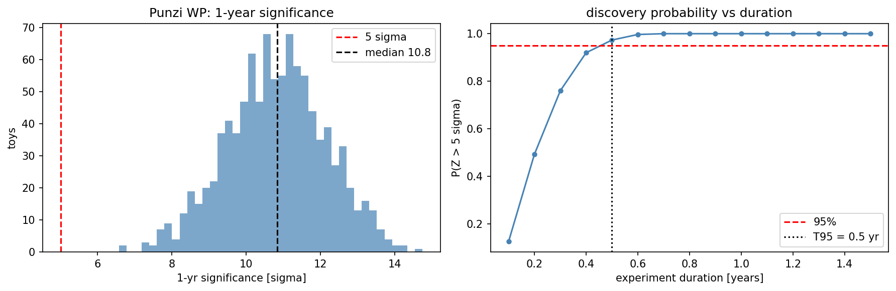
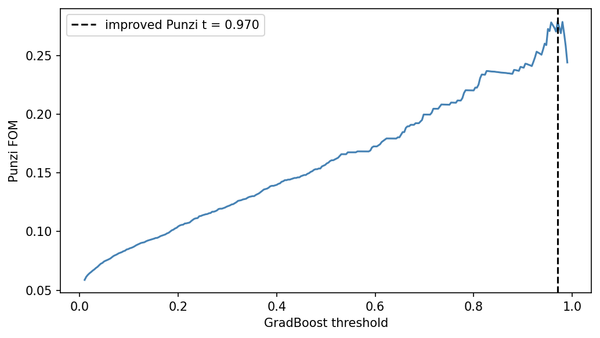
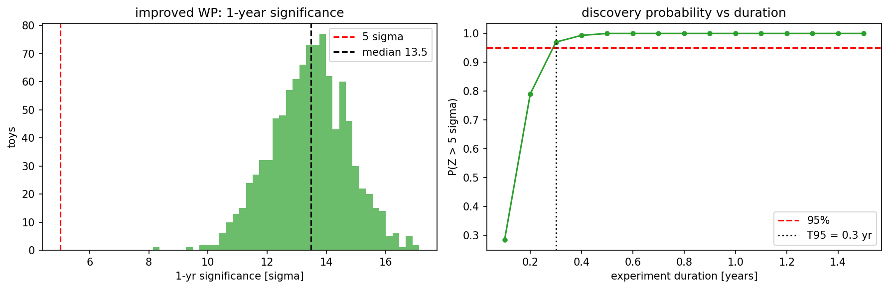

# Particle Discovery — B_s → μμ

search for the rare decay B_s → μμ in 10k signal + 10k background events. build a classifier, optimise the selection, figure out how long the experiment needs to run for a 5σ discovery.

## results

### core

BDT selection applied to all features (excluding MASS to keep the fit unbiased):


AdaBoost on 7 features reaches 92.87% accuracy, 93.05% signal efficiency, 7.26% background efficiency. Feeding that working point into the composite-PDF toy MC gives median 1-year significance ≈ 10σ and a minimum experiment duration of ~0.5 yr for a 95% chance of a 5σ discovery.



### extensions

Each extension is self-contained — it re-runs the same background fit + toy MC as `mass_fit.ipynb` at its own working point, so the core notebook never depends on extension state.

Punzi FOM — pick the threshold that actually minimises experiment runtime instead of just maximising accuracy:


At the Punzi-optimal working point (BDT score ≥ 0.626): signal efficiency 59.0%, background efficiency 0.72%. ~10× stronger background rejection buys a sharper 1-year significance (~10.8σ) and the same T95 ≈ 0.5 yr with more headroom.



A gradient-boosted classifier with 10-fold cross-validation reaches 97.1% CV accuracy (vs 92.9% for AdaBoost). At its Punzi-optimal threshold (BDT score ≥ 0.957) it gives signal efficiency 70.8%, background efficiency 0.12%, median 1-year significance ~13.5σ, and T95 ~0.3 yr:





Wilks' theorem validity — check that q ~ chi2(1) holds at our sample size:


## how to run

run the notebooks in order:

1. `features.ipynb` — rank features by Fisher score
2. `selection.ipynb` — rectangular cuts on top 3 features
3. `bdt.ipynb` — train AdaBoost, apply selection → writes `bdt_results.json`
4. `mass_fit.ipynb` — background fit, toy MC, discovery duration using the core BDT working point

extensions (independent — each reads the core BDT model / data and quotes its own discovery time):

5. `extensions/punzi_fom.ipynb` — Punzi threshold scan on the AdaBoost scores → writes `punzi_results.json`
6. `extensions/classifier_improvements.ipynb` — gradient boosting with 10-fold CV + Punzi scan → writes `improved_results.json`
7. `extensions/wilks_validation.ipynb` — Wilks' theorem validity check with H0 toys

## files

```
data/                           signal + background samples
plots/                          all output figures
features.ipynb                  feature ranking
selection.ipynb                 rectangular cut optimisation
bdt.ipynb                       AdaBoost training + evaluation
mass_fit.ipynb                  significance + discovery duration (core WP)
extensions/                     punzi fom, classifier improvements, wilks validation
fisher_scores.csv               feature ranking (from features.ipynb)
cut_params.json                 optimal cuts (from selection.ipynb)
bdt_results.json                core BDT efficiencies (from bdt.ipynb)
bdt_model.pkl                   trained AdaBoost model
punzi_results.json              Punzi WP + extension-quoted T95
improved_model.pkl              trained gradient-boosted model
improved_results.json           CV + improved-Punzi WP + extension-quoted T95
fit_params.json                 background slope (from mass_fit.ipynb)
```
