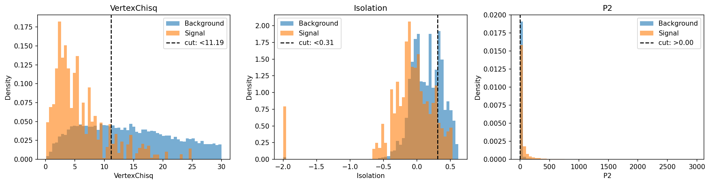

# Particle Discovery — B_s → μμ

search for the rare decay B_s → μμ in 10k signal + 10k background events. build a classifier, optimise the selection, figure out how long the experiment needs to run for a 5σ discovery.

## results

BDT selection applied to all features (excluding MASS to keep the fit unbiased):



baseline AdaBoost on 7 features: 92.87% accuracy, 93.05% signal efficiency, 7.26% background efficiency.

Punzi FOM finds the threshold that actually minimises experiment runtime instead of just maximising accuracy:


at the Punzi-optimal working point (BDT score ≥ 0.626): signal efficiency 59.0%, background efficiency 0.72%. The reduced signal yield is more than compensated for by ~10× stronger background rejection, giving a median 1-year significance of ~10.9σ and a minimum experiment duration of ~0.5 years for a 95% 5σ discovery probability (vs ~0.6 yr at the baseline hard-cut threshold).

Wilks' theorem validity — check that q ~ chi2(1) holds at our sample size:


## how to run

run the notebooks in order:

1. `features.ipynb` — rank features by Fisher score
2. `selection.ipynb` — rectangular cuts on top 3 features
3. `bdt.ipynb` — train AdaBoost, apply selection
4. `extensions/punzi_fom.ipynb` — Punzi FOM threshold scan (writes Punzi efficiencies back into `bdt_results.json`)
5. `mass_fit.ipynb` — background fit, toy MC, discovery duration (picks up the Punzi efficiencies if present, else falls back to the baseline)
6. `extensions/wilks_validation.ipynb` — Wilks' theorem validity check with H0 toys

note: `bdt.ipynb` overwrites `bdt_results.json`, so re-run `extensions/punzi_fom.ipynb` whenever you re-run `bdt.ipynb`, otherwise `mass_fit.ipynb` will silently fall back to the baseline working point.

## files

```
data/                           signal + background samples
plots/                          all output figures
features.ipynb                  feature ranking
selection.ipynb                 rectangular cut optimisation
bdt.ipynb                       AdaBoost training + evaluation
mass_fit.ipynb                  significance + discovery duration
extensions/                     punzi fom, wilks validation
fisher_scores.csv               feature ranking (from features.ipynb)
cut_params.json                 optimal cuts (from selection.ipynb)
bdt_results.json                efficiencies — baseline + Punzi-optimal
bdt_model.pkl                   trained AdaBoost model
fit_params.json                 background slope (from mass_fit.ipynb)
```
